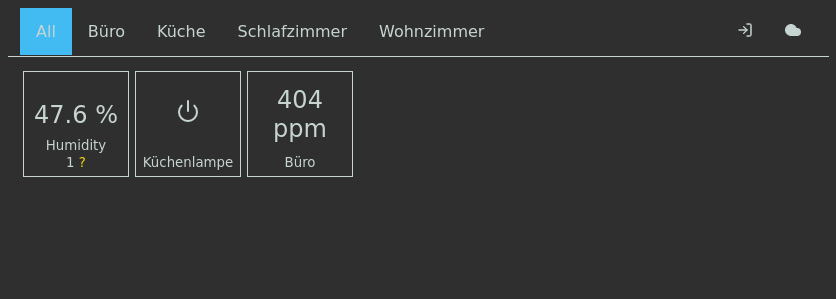
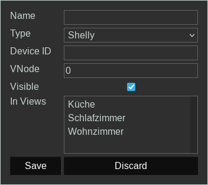

# Home Control

Home Control is a no-cloud Internet of Things solution. 

Home Control has 3 Components
- the [System Backend](https://github.com/iot-home-control/system-backend)
- the Web Frontend (this repository)
- the firmware (to be releases)

The Home Control Web Frontend shows a list of things (T of IOT). It can show the current state of a thing.
If a thing has actions, you can trigger these actions via the Web Frontend.

## Installation Guide
### Requirements
To install the frontend you just need a webserver capable of serving static files (ideally with HTTPs).

### Setup
In the following we assume all non-absolute paths will be relative to the installation directory.
All our examples assume `/opt/home-control/frontend` to be the installation location.

1. Unpack the downloaded release file (or clone this repository) to the installation directory.
1. Create a config file for the Home Control frontend (you can copy `js/config.example.js` to `js/config.js` for a quick start) and fill it out.
   See [the configuration section](#Configuration) for more information.
1. Configure your webserver to serve the frontend.
   You can have a look at the example [nginx configuration snippet](../system-backend/examples/nginx-home-control-snippet.conf) in the backend repository.
   **Important:** You need a working TLS setup.
   Without TLS you won't be able to login and add/configure things.

### Configuration
The configuration file must define a `config` object with the following (optional) properties.
Note that optional properties can be either left out or explicitly set to `undefined`.

- `ws_proto`: *(Optional)* A string specifying which WebSocket protocol to use.
  Valid values as `"ws:"`, and `"wss:"`.
  The latter is for connecting with TLS which is required for authentication. 
  Please note the `:` at the end of the string.
  It is required and **must** be included if you set this value.
  If unset it defaults to `"wss:"` you access the frontend via HTTPs and `"ws:"` otherwise.
- `ws_host`: *(Optional)* A string specifying the hostname to connect to for the WebSocket connection.
  If unset it defaults to the `window.location.hostname` of the browser accessing the frontend.
- `ws_port`: *(Optional)* The port number the WebSocket server (or proxy for it) is listening on.
  If unset it uses the port you are using to access the frontend with your browser (usually 80 or 443).
- `ws_path`: *(Required)* A string specifying the path used to access the WebSocket server.
  In the examples we use `"/ws"`.
  If you want to access the system-backend server directly (that is without a reverse-proxy) set this value to `"/"`
 

## Usage
On first use you will see an empty view.
You probably want to configure your things.
To do that you must be logged in.
To login click the login symbol in the top right corner.
It looks like an arrow pointing into a door.
After logging in, a gear symbol will be visible in the upper right corner.
Click it to switch to *thing configuration mode*.
Click the "Add Thing" tile that became visible to get the "Add Thing dialog":

- Name: is the display name of a thing
- Type can be:
  * Humidity Sensor (built on Home Control Firmware with DHT22, or Shelly Temperature addon with DHT22)
  * Temperature Sensor (built on Home Control Firmware with DHT22, DS18*20 or BMP180, or Shelly Temperature addon with DHT22)
  * Pressure Sensor (built on Home Control Firmware with BMP180)  
  * Switch (built on Home Control Firmware (e.g., a for a  Relay board, or Sonoff module))
  * Soil Moisture Sensor (built on Home Control Firmware with mcp320x ADC and capacitive soil moisture sensor)
  * Shelly (Shelly 1, Shelly 2.5., Shelly Plug S, and probably more)
  * Shelly Button
  * frischluft.works CO2 Sensor
- Device ID: Thing specific ID (see below for details)
- VNode ID: Sensor/Thing specific ID (see below for details)
- Visible: If not checked the thing will always be hidden
- In Views: Here you can in which views the thing will be shown

The same dialogue appears when clicking the edit button of an existing thing in *thing configuration mode*.

### Device and VNode IDs
Home Control uses Device IDs to identify devices on the message queue.
The format of the device ID depends on the used hardware and software:
- For Shelly devices the device ID is the name of the WiFi network the device provided for initial configuration, e.g. `shellyplug-s-xxxxxx`.
- Devices running the Home Control firmware print their device ID on the serial console when powered on, they are of the form `esp8266-xxxxxx`.
- For frischluft.works Sensors the device ID is the complete MAC address of the module.
  The module will display it when you shortly press the button at the top of the device.
  Type in the device ID shown on the display using only lower case characters and ignore the `:` on the display.    
    
The VNode ID identifies the actor or sensor of the selected type on the device.
For devices which only have a single actor or sensor of any type you must put 0 here.
If a device has multiple actors (e.g., relays) or sensors (e.g., temperature and humidity sensors when there are multiple DHT22 sensors connected) you can specify which actor or sensor this virtual thing will handle.
See details for Home Control firmware in its documentation, and for Shelly devices in [their documentation](https://shelly-api-docs.shelly.cloud/).

## Licensing
While the Home Control frontend itself is licensed under the [GNU AGPL 3](LICENSE) this repository also contains the following 3rd party libraries/files which have different licenses:
- `css/tooltip.css`, `js/tooltip.js`: MIT License, Copyright (c) 2016 Arshad Khan
- `img/feather-sprite.svg`: MIT License, Copyright (c) 2013-2017 Cole Bemis
- `img/logo.svg`, and rasterized version of it in the same folder: CC BY-SA 4.0, Hinrikus Wolf
